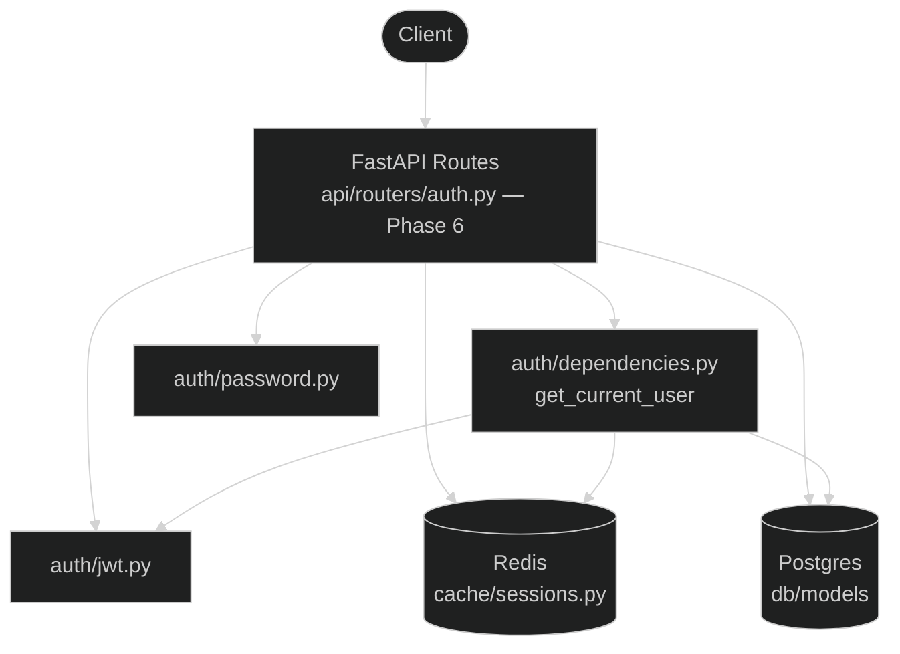
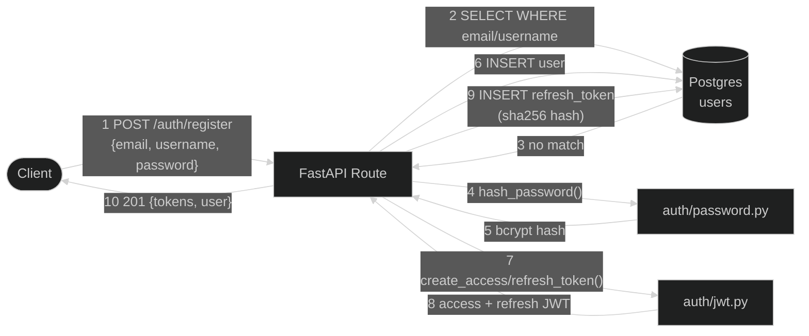
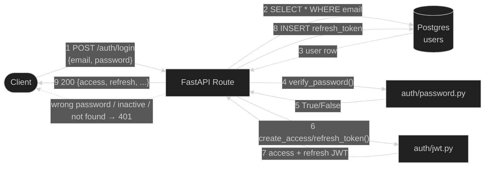
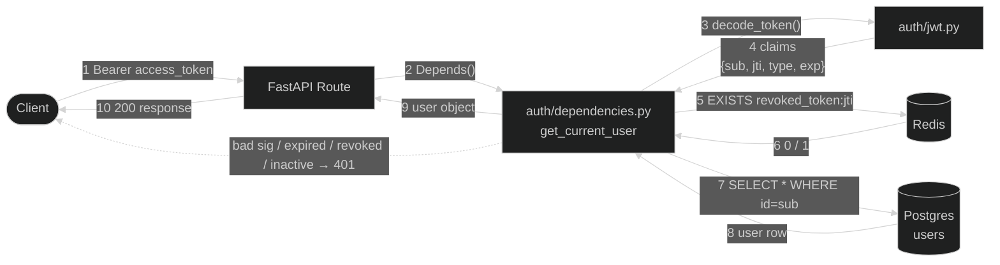
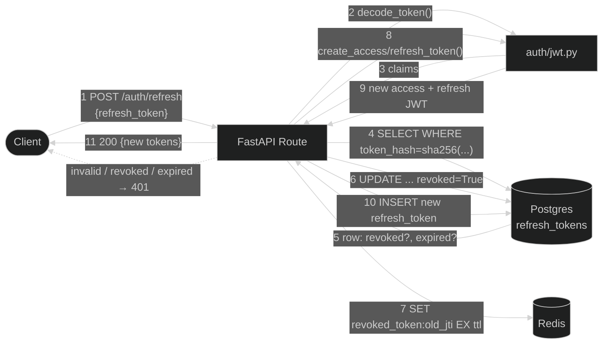
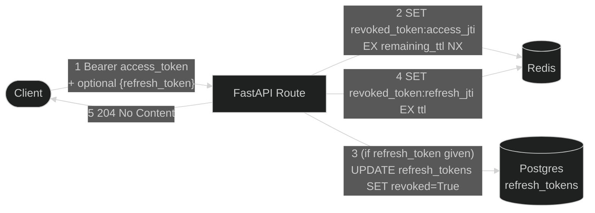

# Auth Flow — Request → DB/Redis → Response

Status as of this writing: `auth/`, `db/`, and `cache/` (Phases 2–4 of `plan.md`) are
built and unit/integration tested **standalone** (see `completed.md`). The
`api/routers/auth.py` FastAPI routes that call these modules over HTTP don't exist
yet — that's Phase 6. Boxes labeled "FastAPI Route" below are the planned Phase 6
handlers; every other box is real, working code today.

## Layers

Why revocation is split across two stores (Redis for access tokens, Postgres for
refresh tokens): access-token checks happen on *every* request and only need to
live 15 minutes, so Redis's speed and auto-expiry fit. Refresh-token revocation
is checked rarely (only at `/auth/refresh`) but must survive a Redis restart
since it's the credential of record, so it lives in Postgres.

---

## 1. Register

---

## 2. Login

---

## 3. Protected request — `GET /auth/me`, any `/sessions/*`

This is `Depends(get_current_user)`, run before the actual route body for every
protected endpoint. **Fully built and tested today**
(`tests/phase3_auth/test_dependencies.py`).

Signature/expiry (step 3–4) is checked before touching Redis or Postgres — a
malformed or expired JWT never costs a network round trip.

---

## 4. Refresh

Step 6 rotates the refresh token — the old one is marked revoked so it can
never be replayed even if intercepted.

---

## 5. Logout

TTL on each Redis key = that token's own remaining lifetime — the blacklist
entry expires itself right when the token would've expired anyway, so it never
needs manual cleanup.

---

## Store responsibilities at a glance

| Concern | Store | Why |
|---|---|---|
| User identity, password hash | Postgres (`users`) | Durable, source of truth |
| Refresh token validity | Postgres (`refresh_tokens`) | Long-lived (7d), must survive Redis restart, needed for reuse-detection |
| Access token blacklist | Redis (`revoked_token:{jti}`) | Checked on every request — needs to be fast; TTL = remaining token life, so it never needs manual cleanup |
| Access/refresh token *contents* | Nowhere — stateless JWT | Signature + `exp` claim is self-validating; only revocation needs a lookup |
