# Phase 21 — CD: EKS via ArgoCD (GitOps): Step-by-Step

Scope: on every push to `main` that touches backend code, build the non-adapter image (reused unchanged from Phase 16/20), push it to ECR under an immutable `eks-<sha>` tag, then **commit the new tag into `gitops/multi-agent/values.yaml` on `main`** — nothing in this workflow ever calls `kubectl`, `helm`, or any EKS-scoped AWS API. ArgoCD, already installed in the Phase 20 cluster and watching that path, detects the Git diff and reconciles the cluster to match. This is the one deploy target in this plan that is GitOps end-to-end; Phases 18–19 (Lambda/ECS) stay direct-push via GitHub-Actions/OIDC, per `plan.md`'s Key Design Decisions row explaining why ArgoCD was reintroduced for EKS specifically and not the other two.

Status: planning only, nothing built yet. **Hard prerequisites**: [Phase 20 (EKS)](./eks-enterprize-deploy-steps.md) applied at least once — this phase needs a real cluster, a real `gitops/multi-agent/` Helm chart, and the chart's Stage B manual `helm install` to have happened, since step 4 below adopts that release rather than creating a second one. Also assumes [Phase 17's CI](./ci-pipeline-steps.md) is green on `main` before this workflow's trigger fires. Companion to [`enterprize-deploy-steps.md`](./enterprize-deploy-steps.md) (Phase 15), [`grand-enterprize-deploy-steps.md`](./grand-enterprize-deploy-steps.md) (Phase 16), [`eks-enterprize-deploy-steps.md`](./eks-enterprize-deploy-steps.md) (Phase 20), [`cd-lambda-deploy-steps.md`](./cd-lambda-deploy-steps.md) (Phase 18), and [`cd-ecs-deploy-steps.md`](./cd-ecs-deploy-steps.md) (Phase 19) — read the last two first, since this doc only calls out where the GitOps shape *differs* from their direct-push pattern, not where it's the same.

---

## Architecture Overview

```mermaid
flowchart LR
    CIPass(["Phase 17 CI: green\non push to main"]) --> Trigger["cd-eks.yml triggers\non: push to main\npaths-ignore: gitops/multi-agent/**"]
    Trigger --> OIDC["Assume IAM role via\nGitHub OIDC\n(ECR push only — no eks:*,\nno kubectl-equivalent permission)"]
    OIDC --> Build["docker build\n(non-adapter image,\nreused unchanged from Phase 16/20)"]
    Build --> Push["Push to ECR\ntag: eks-git-sha (immutable)"]
    Push --> Bump["yq -i patch\ngitops/multi-agent/values.yaml\nimage.tag = eks-sha"]
    Bump --> Commit["git commit + push to main\n(GITHUB_TOKEN, contents: write,\nauthor: github-actions[bot])\nWorkflow job ends here"]
    Commit -.->|"Git diff on\ngitops/multi-agent/**\n(polled, ~3min default,\nor argocd app sync manually)"| ArgoWatch["ArgoCD Application\n(already running in-cluster,\nfrom Phase 20)"]
    ArgoWatch --> Sync["OutOfSync -> Syncing"]
    Sync --> Apply["ArgoCD applies the Helm\nchart diff to the cluster\n(no CI job touches kubectl)"]
    Apply --> Health{"Rollout healthy?"}
    Health -->|yes| Healthy["Synced / Healthy\nnew pods serving"]
    Health -->|no, e.g. bad image tag| Degraded["Degraded —\nprevious pods keep serving,\nrollout does not complete"]
    Healthy --> Smoke["Manual/scripted smoke test:\nregister -> login -> chat via\nALB/CloudFront URL"]
```



---

## Why GitOps here, why a bot commit, why the CI job ends at a commit

**This is the one place in the whole plan where CI never touches the cluster.** Phases 18–19's workflows call `lambda:UpdateFunctionCode`/`ecs:UpdateService` directly with a role scoped to exactly that action. This workflow's deploy role needs **no EKS-facing permission at all** — the only AWS action it performs is an ECR push. The actual "deploy" (applying a new Deployment spec to the cluster) is done entirely by ArgoCD's own in-cluster reconciliation loop, which already has cluster-admin-scoped access because it *is* a workload running inside the cluster, not a remote caller. That split — CI can push images and edit a Git file, but only the cluster's own controller can ever change what's running in the cluster — is the actual security property GitOps buys over Phases 18–19's model, not just a style preference.

**Why a bot commit instead of `helm upgrade`/`kubectl set image` from the workflow**: the moment the workflow ran `kubectl apply` directly, it would stop being GitOps and become "CD with extra steps" (per `plan.md`'s own framing) — the live cluster state and the Git repo's declared state could drift independently, and ArgoCD's `selfHeal` would fight the workflow's own changes the next time it polled. Routing every change through a Git commit means the repo stays the single source of truth `git log` on `gitops/multi-agent/` is a complete deploy history, and `argocd app history`/`rollback` work against real commits, not against whatever the last `kubectl` caller happened to run.

**Why the workflow's job ends at the commit, not at a "confirmed healthy" check**: matches `plan.md`'s Phase 21 step 3 verbatim. The alternative — blocking the workflow on `argocd app wait --health` — is offered below as an **optional** second job, not the default, because doing so reintroduces a CI-to-cluster dependency (the workflow needs a way to talk to the ArgoCD API, i.e. a token/credential CI holds) that the whole point of this phase was to avoid needing for the *deploy* step itself. Verification is real work and worth doing — it's just deliberately decoupled from "did the commit succeed."

---

## Prerequisites

- Phase 20 (EKS) applied at least once, including its Stage B step 12 `helm install` of `gitops/multi-agent/` — this phase adopts that release, see step 4 and its Gotcha below.
- Phase 17's CI workflow in place and green on `main`.
- `argocd` CLI and `yq` available locally for the one-time setup steps (not needed in the GitHub Actions runner except `yq`, which the workflow installs).
- A GitHub OIDC provider already registered in AWS (reused from Phase 18/19 if built first — see their docs' step 1; otherwise register it once here).
- Decide now whether `gitops/multi-agent/`'s repo is public or private to ArgoCD's view — if private, step 2 needs a repo credential (PAT or deploy key), not just the `Application` resource.

---

## Steps

1. **Install ArgoCD into the Phase 20 cluster** via its own Helm chart (not this project's `gitops/` chart):
   ```bash
   helm repo add argo https://argoproj.github.io/argo-helm
   helm repo update
   helm install argocd argo/argo-cd \
     --namespace argocd --create-namespace \
     --set server.service.type=ClusterIP
   ```
   `ClusterIP`, not `LoadBalancer` — no public Ingress for ArgoCD itself, matching `plan.md`'s existing pattern of skipping anything not needed to prove the concept (same reasoning as no custom domain in Phases 15–16). Access is `kubectl -n argocd port-forward svc/argocd-server 8080:443`, and the initial admin password is `kubectl -n argocd get secret argocd-initial-admin-secret -o jsonpath='{.data.password}' | base64 -d`.

2. **If `gitops/multi-agent/`'s repo is private**, register repo credentials with ArgoCD before creating the `Application` — the `Application` resource (step 3) only names a `repoURL`, it carries no credentials of its own:
   ```bash
   argocd repo add https://github.com/<owner>/<repo>.git \
     --username <bot-username> --password <PAT-with-repo-scope>
   ```
   (or an SSH deploy key via `argocd repo add git@github.com:<owner>/<repo>.git --ssh-private-key-path ...` — either works, pick one and keep it consistent with however Phase 17/18/19's own repo access, if any, is set up.)

3. **Create the ArgoCD `Application` resource**, pointing at this same repo (not a separate GitOps repo, per `plan.md`'s Key Design Decisions — a second repo would add real overhead with no benefit at single-developer scale):
   ```yaml
   # argocd/multi-agent-application.yaml — applied once via kubectl, not templated by the chart itself
   apiVersion: argoproj.io/v1alpha1
   kind: Application
   metadata:
     name: multi-agent
     namespace: argocd
   spec:
     project: default
     source:
       repoURL: https://github.com/<owner>/<repo>.git
       targetRevision: main
       path: gitops/multi-agent
       helm:
         valueFiles:
           - values.yaml
     destination:
       server: https://kubernetes.default.svc
       namespace: multi-agent
     syncPolicy:
       automated:
         prune: true
         selfHeal: true
       syncOptions:
         - CreateNamespace=true
   ```
   `kubectl apply -f argocd/multi-agent-application.yaml`. `prune: true` + `selfHeal: true` is the automated policy `plan.md` specifies — ArgoCD both applies new Git state and reverts any manual in-cluster drift back to what Git says, which is exactly why the teardown Gotcha below matters.

4. **Adopt, don't duplicate, Phase 20's manually-installed Helm release.** Phase 20 Stage B step 12 already ran `helm install multi-agent gitops/multi-agent ...` by hand, before ArgoCD existed. Before step 3's `Application` does its first sync, confirm the release name/namespace it will manage (`multi-agent` / `multi-agent` namespace, per the manifest above) exactly matches what Phase 20 already installed — otherwise ArgoCD creates a *second*, competing set of resources rather than taking over the first. Simplest correct handoff: `helm uninstall multi-agent -n multi-agent` right before creating the `Application`, so ArgoCD's first sync is a clean create, not an adoption of unlabeled resources.

5. **Create `.github/workflows/cd-eks.yml`** (see below) — triggered on push to `main`, **with a `paths-ignore` on `gitops/multi-agent/**`** (see the loop-prevention Gotcha — this is not optional).

6. **Build and tag** the non-adapter image (same `Dockerfile.ecs` / plain `CMD ["python", "run_api.py"]` build Phase 16 already established) with an immutable `eks-<sha>` tag, push to ECR — a distinct tag prefix from Phase 16's `ecs-<sha>` and Phase 20's own build-path tag, so all three deploy targets can be rolled back independently without fighting over one mutable tag, matching `eks-enterprize-deploy-steps.md`'s own `:eks` tagging note.

7. **Patch `gitops/multi-agent/values.yaml`** in place with `yq -i '.image.tag = "eks-<sha>"'` — never hand-edit the full values file in the workflow; patch only the one field Phase 20's chart already exposes for this purpose.

8. **Commit and push directly to `main`** as `github-actions[bot]`, using the workflow's own `GITHUB_TOKEN` (`permissions: contents: write` — see Gotchas for why this must be explicit) — no PAT, no new secret, scoped to this repo only by the token's own default scoping.

9. **Verification is manual (or an optional second job, see below), not blocking the workflow**: `argocd app get multi-agent` (or the UI via port-forward) should show `OutOfSync → Syncing → Synced`/`Healthy` within one ArgoCD poll interval (default 3 minutes) of the commit landing, or immediately after `argocd app sync multi-agent --force` for a faster demo loop. Once healthy, run the same manual smoke test as Phase 20 (register → login → create session → chat → SSE stream) against the ALB/CloudFront URL.

10. **Failure-path test, required per `plan.md`'s testing convention**: push a commit that bumps `values.yaml` to a deliberately-nonexistent image tag, confirm `argocd app get multi-agent` reports `Degraded` (not `Synced`) while `kubectl get pods -n multi-agent` still shows the *previous* revision's pods `Running` and still serving traffic through the ALB — the rollout simply never completes rather than taking the service down, since the previous `ReplicaSet` is never scaled to zero until the new one is healthy. Recover by pushing a commit reverting to a known-good tag (or `argocd app rollback multi-agent <previous-revision-id>` directly, bypassing Git for an emergency rollback — note this creates exactly the kind of live/Git drift `selfHeal` will silently re-revert on its next reconcile, so follow any emergency `rollback` with a matching Git revert, not just a UI action).

---

## GitHub Actions Workflow

```yaml
# .github/workflows/cd-eks.yml
name: CD - EKS (GitOps)

on:
  push:
    branches: [main]
    # Loop-prevention: this workflow's own bot commit (step 8) only ever
    # touches this one file. Without this, every deploy would re-trigger
    # itself indefinitely. See Gotchas.
    paths-ignore:
      - 'gitops/multi-agent/**'

# Same reasoning as Phases 18/19: never cancel a run mid-commit. A canceled
# image-build can leave an orphaned ECR push; a canceled git-push can leave
# values.yaml half-patched in the working tree (though not committed).
concurrency:
  group: cd-eks-${{ github.ref }}
  cancel-in-progress: false

permissions:
  id-token: write    # OIDC -> ECR push only, nothing EKS-scoped
  contents: write    # NOT the default — required to push the bot commit

jobs:
  build-and-bump:
    runs-on: ubuntu-latest
    steps:
      - name: Checkout
        uses: actions/checkout@v4

      - name: Configure AWS credentials (OIDC)
        uses: aws-actions/configure-aws-credentials@v4
        with:
          role-to-assume: arn:aws:iam::<account-id>:role/github-actions-cd-eks
          aws-region: <region>

      - name: Login to ECR
        id: ecr-login
        uses: aws-actions/amazon-ecr-login@v2

      - name: Build and push image
        working-directory: backend
        env:
          ECR_REPO: ${{ steps.ecr-login.outputs.registry }}/crag-backend
          IMAGE_TAG: eks-${{ github.sha }}
        run: |
          docker build -t "$ECR_REPO:$IMAGE_TAG" -f Dockerfile.ecs .
          docker push "$ECR_REPO:$IMAGE_TAG"
          echo "IMAGE_TAG=$IMAGE_TAG" >> "$GITHUB_ENV"

      - name: Install yq
        uses: mikefarah/yq@v4

      - name: Bump image tag in gitops/multi-agent/values.yaml
        run: yq -i ".image.tag = \"${IMAGE_TAG}\"" gitops/multi-agent/values.yaml

      - name: Commit and push
        run: |
          git config user.name "github-actions[bot]"
          git config user.email "github-actions[bot]@users.noreply.github.com"
          git add gitops/multi-agent/values.yaml
          git commit -m "chore(cd): bump multi-agent image to ${IMAGE_TAG}"
          git push origin HEAD:main

  # Optional — deliberately a separate job, gated behind confirming AWS access
  # to an ArgoCD API token is something you actually want CI to hold. Not
  # required for the GitOps model itself to work (see "Why the CI job ends
  # at a commit" above) — enable if unattended smoke verification is worth
  # the extra credential surface.
  verify:
    if: false   # flip to true once an ARGOCD_AUTH_TOKEN secret is provisioned
    needs: build-and-bump
    runs-on: ubuntu-latest
    steps:
      - name: Wait for ArgoCD sync + health
        run: |
          argocd app wait multi-agent \
            --auth-token "${{ secrets.ARGOCD_AUTH_TOKEN }}" \
            --server <argocd-server-host> \
            --health --sync --timeout 300

      - name: Smoke check
        run: |
          curl -sf --retry 5 --retry-delay 3 https://<cloudfront-or-alb-domain>/health
```

---

## Gotchas

- **The bot commit will re-trigger this workflow (and every other push-triggered workflow in this repo) unless scoped out.** `cd-eks.yml`'s own commit in step 8 only touches `gitops/multi-agent/values.yaml` — without the `paths-ignore` in the workflow above, that push satisfies `on: push: branches: [main]` and starts a second run, which builds an identical image, commits an identical tag bump (a no-op diff, but still a commit and a push), and triggers a third run, and so on indefinitely. **This isn't limited to `cd-eks.yml` itself**: `ci-pipeline-steps.md`'s `ci.yml` and `cd-lambda-deploy-steps.md`/`cd-ecs-deploy-steps.md`'s workflows all trigger on unscoped `push: branches: [main]` with no path filter at all — the bot commit here will also re-run Phase 17's lint+test job and, more concerningly, re-run Phases 18/19's *deploy* workflows against unchanged Lambda/ECS code every single time an EKS-only change ships. If those three workflows are already live when this phase is built, retrofit the same `paths-ignore: ['gitops/multi-agent/**']` onto all of them — not just this one — or accept redundant CI runs and (worse) redundant Lambda/ECS redeploys as a known cost.

- **`contents: write` is not the default `GITHUB_TOKEN` permission and is easy to miss** — the same class of "not on by default" gotcha as Phase 18's `id-token: write` note. Many orgs additionally set the repo/org-level default to read-only for `GITHUB_TOKEN`, in which case the explicit `permissions: contents: write` block in the workflow *is* sufficient to override it for this job — but confirm this org setting isn't itself set to a hard maximum that blocks write entirely, which would fail the commit step with a permissions error that looks like a Git authentication problem rather than a GitHub Actions settings problem.

- **A branch-protection rule on `main` requiring PR review will reject this workflow's direct push outright.** `git push origin HEAD:main` from `GITHUB_TOKEN` is a direct push, not a PR — if `main` has branch protection requiring reviews or status checks before merge, this fails with a permissions/protection error, not a Git error. Either add an explicit bypass allowance for `github-actions[bot]` (or the specific Actions app) on that branch protection rule, or change this workflow to open an auto-mergeable PR instead of pushing directly — decide which before relying on this being hands-off, since the failure mode (a silently-rejected push) is easy to mistake for the workflow being broken rather than a repo setting.

- **`selfHeal: true` will fight Phase 20's own teardown procedure if not disabled first.** `eks-enterprize-deploy-steps.md`'s Stage D step 22 requires manually deleting the `Ingress` (or `helm uninstall`) *before* `terraform destroy`, so the AWS Load Balancer Controller can deprovision the ALB out-of-band. With this phase's `Application` still on `automated` sync, ArgoCD's `selfHeal` will simply notice the `Ingress` disappeared and recreate it from Git within one reconcile — the manual teardown step silently undoes itself. **Before starting Phase 20's teardown sequence, either delete this phase's `Application` resource (`kubectl delete application multi-agent -n argocd`) or disable its automated sync (`argocd app set multi-agent --sync-policy none`) first** — this ordering isn't optional once Phase 21 exists, even though Phase 20's own doc (written before this phase) doesn't mention it.

- **Never pin `values.yaml`'s `image.tag` to a mutable value like `latest`.** This matters even more here than in Phases 18/19: ArgoCD detects work to do purely from a *Git diff*. If every deploy wrote the same literal string (`latest`) into `values.yaml`, there would be no diff at all after the first deploy — ArgoCD would report `Synced` forever and never re-pull the new image, regardless of how many times a new image was actually pushed to ECR. The immutable `eks-<sha>` tag isn't just a traceability nicety here, it's the entire mechanism this deploy path depends on to detect that anything changed.

- **ArgoCD's default 3-minute poll interval means "push commit → cluster updated" is not instant**, and this design deliberately has no public Ingress for ArgoCD (step 1) to receive a GitHub webhook for instant sync — that would mean exposing the ArgoCD API publicly, reopening the exact "skip anything not needed to prove the concept" tradeoff `plan.md` already made against a custom domain in Phases 15–16. For a demo, `argocd app sync multi-agent --force` right after the bot commit lands is the accepted workaround, not a webhook.

- **`argocd app rollback` and a Git revert can disagree if used independently.** An emergency `argocd app rollback multi-agent <revision>` changes live cluster state immediately without touching Git — the fastest way to recover from the failure-path scenario in step 10, but it now means Git (`values.yaml`) and the live cluster disagree. `selfHeal` will not revert this immediately (rollback and Git state coincidentally still match at that instant only if the rollback target matches the last-known-good Git commit), but the *next* unrelated commit to `main` will trigger a fresh ArgoCD sync back to whatever `values.yaml` currently says — which is the broken tag, if the emergency rollback was never followed by a matching Git revert. Always follow an emergency `rollback` with a real commit fixing `values.yaml`, treating the `rollback` command as a stopgap, not a fix.

- **IAM role scope for this workflow is real and worth stating explicitly, since it's easy to over-grant by copying Phase 18/19's role**: this role needs `ecr:GetAuthorizationToken`/`BatchCheckLayerAvailability`/`PutImage`/etc. on the shared ECR repo — and nothing else. No `eks:*`, no `iam:PassRole`, no `lambda:*`/`ecs:*`. `contents: write` is a **GitHub** permission (governing what `GITHUB_TOKEN` can do to this repo), entirely separate from the **AWS** IAM role assumed via OIDC — conflating the two when writing the role's trust/permission policy is an easy mistake that either over-grants AWS access for no reason or, if someone tries to express "repo write" as an IAM policy statement, simply does nothing.
