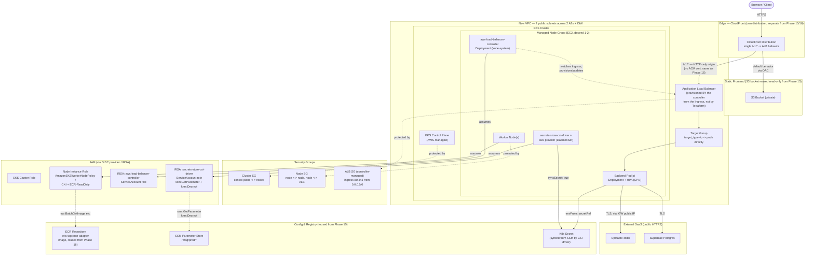

# Phase 20 — AWS Container Deployment: EKS (Kubernetes) — Step-by-Step

Scope: an EKS cluster + managed node group + IRSA, the AWS Load Balancer Controller (Helm-installed, provisioning a real ALB from a Kubernetes `Ingress` rather than a hand-written Terraform `aws_lb`), the Secrets Store CSI Driver + AWS provider (syncing SSM `SecureString` parameters into a native Kubernetes `Secret`), and a new `gitops/multi-agent/` Helm chart for the backend — provisioned with Terraform + Helm, validated on LocalStack Ultimate before real AWS. Additive, not a replacement for [Phase 16's ECS Fargate](./grand-enterprize-deploy-steps.md) — that phase's cost-driven reasoning stands untouched; this phase exists specifically to get real Kubernetes/Helm experience, now that LocalStack Ultimate also emulates EKS. Full design/rationale lives in `plan.md`'s Phase 20 section and Key Design Decisions table — this doc is the execution checklist. Companion to [`enterprize-deploy-steps.md`](./enterprize-deploy-steps.md) (Phase 15) and [`grand-enterprize-deploy-steps.md`](./grand-enterprize-deploy-steps.md) (Phase 16), both of which this phase reuses config/secrets/state from. Phase 21's ArgoCD/GitOps CD gets its own companion doc, [`ci-cd-eks-steps.md`](./ci-cd-eks-steps.md), the same way Phase 18/19's CD got `cd-lambda-deploy-steps.md`/`cd-ecs-deploy-steps.md` — out of scope here.

Status: planning only, nothing built yet. **Hard prerequisite: Phase 15 must already be applied at least once** (this phase reuses its ECR repo, SSM parameters, Upstash/Supabase config). Phase 16 is *not* a hard prerequisite — Phase 20 provisions its own VPC rather than sharing Phase 16's, see the Open Questions section — but reuses its non-adapter (`plain uvicorn CMD`) image variant unchanged.

---

## Architecture Overview

---

## Prerequisites

**Tooling** — same as Phases 15–16 (Terraform CLI, AWS CLI, Docker, LocalStack CLI + `tflocal`), **plus new**:
- `kubectl`
- `helm` (v3)
- `aws eks update-kubeconfig` — bundled in AWS CLI v2, uses the `client.authentication.k8s.io/v1beta1` exec plugin (`aws eks get-token`) natively; no separate `aws-iam-authenticator` binary needed
- `eksctl` **not required** — this phase is Terraform-first like everything else in this plan; `eksctl` is a common shortcut for IRSA/node-group setup but adds a second IaC tool for no real benefit here

**Accounts / state carried over from Phase 15**
- The same LocalStack Ultimate subscription from Phases 15–16 — EKS emulation is Ultimate-tier (confirm current tier requirements before relying on this, LocalStack's tier boundaries have moved before, see Phase 15's own note about the Hobby/Base/Ultimate split changing). **Treat LocalStack's EKS emulation as the least proven of the three** (Lambda/ECS/EKS) going into Stage B — it stands up a real local cluster behind a mocked EKS API rather than emulating a real AWS control plane the way Lambda/API Gateway do.
- Phase 15's ECR repo (reusing Phase 16's non-adapter `:ecs`-shaped image, retagged or reused as `:eks`), SSM parameters, Upstash Redis, Supabase Postgres — all reused unchanged.

**New for this phase**
- The AWS Load Balancer Controller's IAM policy JSON (published by AWS on GitHub, `iam_policy.json` — fetch the version matching the controller release being installed, don't hand-write it)
- Node instance type/count decision — see Open Questions
- A load-testing tool for the HPA verification — reuse Phase 16's choice (`hey`) rather than picking a new one

---

## Stage A — Terraform (cluster, nodes, IRSA) & Helm chart scaffolding

1. Reuse Phase 16's non-adapter image build path unchanged (plain `CMD ["python", "run_api.py"]`) — push it to the shared ECR repo under its own tag (e.g. `:eks`) so Phase 16 and Phase 20 can each be torn down and rebuilt independently without fighting over one mutable tag.
2. New Terraform root, `infra/eks/` — kept **separate** from Phase 15/16's `infra/` state (own backend config, own `terraform destroy` boundary), since this phase's control-plane cost makes independent teardown more important here than for any other phase in this plan.
3. Provision a **new, minimal VPC** — 2 public subnets across 2 AZs, one Internet Gateway, one route table with a `0.0.0.0/0 → igw` route (mirrors Phase 16's public-subnet/no-NAT shape exactly) — **not** a shared VPC with Phase 16, see Open Questions for why.
4. `aws_eks_cluster` + its cluster IAM role (trust: `eks.amazonaws.com`, managed policy `AmazonEKSClusterPolicy`); `aws_iam_openid_connect_provider` pointed at the cluster's own OIDC issuer URL/thumbprint — this is what makes IRSA possible, and is the single most commonly-missed EKS Terraform resource (nothing errors if it's skipped — IRSA role trust policies just silently never match, and pods fall back to the node's own instance-profile permissions instead, a real security regression that's easy not to notice)
5. `aws_eks_node_group` (managed, on-demand) + node IAM role (trust: `ec2.amazonaws.com`, managed policies `AmazonEKSWorkerNodePolicy` + `AmazonEKS_CNI_Policy` + `AmazonEC2ContainerRegistryReadOnly`) — instance type/count per Open Questions
6. Two IRSA roles, each trusting the OIDC provider scoped to a specific `system:serviceaccount:<namespace>:<name>` subject via a `Condition`: one for `aws-load-balancer-controller` (kube-system), attached to the AWS-published policy JSON from Prerequisites; one for the Secrets Store CSI Driver's AWS provider, a narrow `ssm:GetParameter`/`ssm:GetParametersByPath` + `kms:Decrypt` policy scoped to `/crag/prod/*` — the same shape as Phases 15–16's roles, just IRSA-trusted instead of Lambda-/task-execution-trusted
7. `gitops/multi-agent/` Helm chart (see `plan.md`'s New Project Structure) — templates for the backend `Deployment` (readiness/liveness on `/health`), `Service` (ClusterIP), `HorizontalPodAutoscaler` (CPU target, mirroring Phase 16's target-tracking policy), `Ingress` (ALB-controller annotations: `alb.ingress.kubernetes.io/scheme: internet-facing`, `target-type: ip`, health-check path `/health`), and a `SecretProviderClass` CRD (see step 9 below) — `values.yaml`-driven, image tag included, so Phase 21's CD workflow has exactly one field to bump later

## Stage B — Validate on LocalStack

8. Confirm the LocalStack Ultimate subscription covers EKS at whatever tier LocalStack currently requires — check before assuming Phase 15/16's same trial window is sufficient, since EKS may have moved tiers since either of those phases were validated.
9. `terraform apply` against LocalStack: VPC, cluster, node group, OIDC provider, both IRSA roles.
10. `aws eks update-kubeconfig --endpoint-url <localstack> --name <cluster>`; `kubectl get nodes` — confirm the node group's node(s) show `Ready`. **This is the first real point of failure risk in this phase** — if LocalStack's EKS emulation doesn't fully wire node-group-to-control-plane registration, nothing past this point will work; don't assume it does without checking here first.
11. `helm install` the AWS Load Balancer Controller and the Secrets Store CSI Driver + AWS provider into `kube-system`, each with its IRSA-annotated `ServiceAccount` (`eks.amazonaws.com/role-arn` annotation pointing at the IRSA role from Stage A step 6).
12. `helm install` the `gitops/multi-agent/` chart from Stage A step 7.
13. `kubectl get ingress` — wait for the AWS Load Balancer Controller to populate `status.loadBalancer.ingress[0].hostname` (this is LocalStack provisioning a real ALB in response to the `Ingress`, not a Terraform resource — see the Resource Wiring table for why that distinction matters at teardown time). **Second real point of failure risk**: confirm LocalStack's ALB emulation actually responds to controller-driven provisioning, not just direct Terraform `aws_lb` calls the way Phase 16 exercised it.
14. Once the ALB hostname exists, apply a **second, small Terraform config** (or a `null_resource` + `local-exec` reading `kubectl get ingress -o jsonpath=...`) that creates the CloudFront distribution pointed at that hostname plus the reused S3 origin — this two-step ordering (cluster/Helm first, CloudFront second) is unavoidable because the ALB doesn't exist until the controller creates it, which can't happen before the cluster and chart are already up.
15. Smoke test through the CloudFront domain: register → login → create session → chat → SSE stream — same flow as Phases 15–16, now via the ALB/Ingress path; confirm the `SecretProviderClass`-synced `K8sSecret` actually populated the pod's env vars (`kubectl exec ... -- env | grep OPENAI` as a sanity check, not just "the app didn't crash").

## Stage C — Real AWS

16. Point both Terraform roots (`infra/eks/` and the CloudFront one from Stage B step 14) at real AWS.
17. `terraform apply` for the cluster/node group/IRSA; `helm install` the controller/CSI-driver/app chart, same order as Stage B.
18. Run the same manual smoke test against the live CloudFront URL.
19. HPA verification: drive a synthetic CPU-heavy load (`hey`, reused from Phase 16) against the service, confirm the `HorizontalPodAutoscaler` actually adds a pod — the Kubernetes-native version of Phase 16's autoscaling check.
20. Failure-path test: `kubectl delete pod` on a running backend pod, confirm the `Deployment` replaces it and the `Service`/target group stop routing to it mid-replacement — same reliability guarantee Phase 16 proved for ECS, now proved for Kubernetes's own reconciliation loop.
21. Re-run the same Redis/DB failure-path checks as Phases 15–16 (Upstash down, DB down → documented graceful degrade, not a crash).

## Stage D — Wrap-up

22. **Teardown order matters more here than in any other phase**: `helm uninstall multi-agent` (or `kubectl delete ingress`) **first**, and wait for the AWS Load Balancer Controller to actually deprovision the ALB — confirm it's gone (`aws elbv2 describe-load-balancers` or the console), **before** running `terraform destroy` on the cluster/node-group root. The ALB was never a Terraform resource (the controller created it out-of-band), so `terraform destroy` has no idea it exists and will not delete it — an orphaned ALB left billing hourly with nothing pointing at it is the single easiest mistake to make with this phase specifically.
23. `terraform destroy` the CloudFront/S3-origin config, then the cluster/VPC/node-group config.
24. Update `completed.md` / `plan.md` phase status once verified end-to-end.

---

## Open questions surfaced during this pass

- **Shared vs. new VPC** — reuse Phase 16's VPC, or provision a new one? **Resolved**: new, minimal VPC (Stage A step 3) — keeps Phase 20 fully independent of Phase 16's live state, avoids retagging a VPC something else already depends on (EKS requires `kubernetes.io/cluster/<name>` subnet tags that Phase 16 never needed), and matches this plan's existing precedent of each deploy-target phase being independently destroyable.
- **Node instance type/count** — `plan.md` only says "smallest general-purpose instance type." **Resolved**: `t3.medium`, desired size 1 (2 for the HPA verification step only, scaled back down after). `t3.small` risks not leaving enough headroom once `kube-proxy`, the VPC CNI (`aws-node`), CoreDNS, the Load Balancer Controller, and the CSI driver's DaemonSet are all scheduled alongside the actual backend pod — undersizing this is a plausible real gap to hit in Stage B, not a theoretical one.
- **Secret injection mechanism** — reuse Phase 15's `boto3`-in-`config.py` path (simplest, but reintroduces the Lambda-specific workaround Phase 16 deliberately avoided), or the idiomatic EKS-native pattern? **Resolved**: **Secrets Store CSI Driver + AWS provider**, syncing SSM `SecureString` parameters into a real Kubernetes `Secret` (`syncSecret.enabled: true`) that the backend `Deployment` consumes via `envFrom: secretRef`, matching how Phase 16 resolved the same question with ECS-native `secrets`. `config.py` needs **zero changes** for this — its existing Lambda-only `boto3` branch (gated on `AWS_LAMBDA_FUNCTION_NAME`, per Phase 16's resolution) is already scoped away from every other target; on EKS, `APP_ENV=production` resolves straight from `os.environ`, exactly like ECS.
- **CloudFront wiring order / one distribution or three** — does this phase share Phase 16's CloudFront distribution (swapping its `/v1/*` origin between ECS and EKS depending on which is "live"), or get its own? **Resolved**: its **own** distribution (Stage A/B steps 14), reusing the S3 bucket as a read-only second origin rather than re-uploading the frontend. Sharing one distribution across ECS and EKS would mean only one deploy target could ever be "live" at a time without a manual origin swap — worse for a project where the whole point of Phase 20 is comparing two real deploy targets, and it avoids the ALB-doesn't-exist-yet ordering problem leaking into Phase 16's already-working distribution.
- **ALB teardown ordering** — since the AWS Load Balancer Controller provisions the ALB out-of-band from Terraform, what deletes it? **Resolved**: `helm uninstall`/`kubectl delete ingress` must run before `terraform destroy`, explicitly documented in Stage D step 22 — this is a new failure mode Phase 16 didn't have (its ALB was a first-class Terraform resource, deleted by `terraform destroy` like everything else).

---

## Resource Wiring Detail: IAM roles (IRSA), security groups, inputs/outputs (design only)

Fills in the permissions/roles/SGs/wiring left implicit in Stage A/B above, and closes the open questions. Companion to the equivalent sections in [`enterprize-deploy-steps.md`](./enterprize-deploy-steps.md) (Phase 15, no VPC/SGs at all) and [`grand-enterprize-deploy-steps.md`](./grand-enterprize-deploy-steps.md) (Phase 16, first VPC/SGs in this project) — read those first; this phase's networking model is closest to Phase 16's, with IRSA added on top as the one genuinely new IAM concept.

**IRSA is the one IAM concept this phase adds that neither Phase 15 nor 16 needed.** Lambda's execution role and ECS's task roles are both attached to the *compute resource itself* (the function, the task); a pod has no equivalent AWS-native identity of its own. IRSA closes that gap: the OIDC provider (Stage A step 4) lets a Kubernetes `ServiceAccount`, via a signed projected token, assume an IAM role whose trust policy names that exact `system:serviceaccount:<namespace>:<name>` subject — so two pods on the same node, using different `ServiceAccount`s, can hold genuinely different AWS permissions, something a shared node instance-profile alone could never express. This is also why skipping the OIDC provider resource (easy to do, since Terraform gives no error for a role whose trust policy simply never matches anything) is a *silent* security regression rather than a loud failure — worth testing for explicitly (`kubectl exec ... -- aws sts get-caller-identity` should show the IRSA role's ARN, not the node role's).

**Per-resource IAM / security-group / wiring table:**

| Resource (Terraform/K8s type) | IAM role or security group | Inputs (← from) | Outputs (→ consumed by) |
|---|---|---|---|
| VPC + 2 public subnets + IGW + route table (`aws_vpc`, `aws_subnet` ×2, `aws_internet_gateway`, `aws_route_table`) | — | subnets tagged `kubernetes.io/cluster/<name> = shared` + `kubernetes.io/role/elb = 1` (EKS/ALB-controller subnet discovery — the one tag neither Lambda nor plain ECS/ALB Terraform needed) | subnet IDs → cluster + node group `vpc_config`; VPC ID → cluster/node security groups |
| EKS cluster role (`aws_iam_role`, trust `eks.amazonaws.com`) | managed policy `AmazonEKSClusterPolicy` | — | `arn` → `aws_eks_cluster.role_arn` |
| EKS cluster (`aws_eks_cluster`) | runs as the cluster role above | `vpc_config.subnet_ids` ← the two public subnets | `endpoint`, `certificate_authority`, and **`identity.oidc.issuer`** → the OIDC provider below; consumed by `kubectl`/Helm via `aws eks update-kubeconfig` |
| cluster security group (created automatically by `aws_eks_cluster`, or a custom `aws_security_group` if overriding) | ingress: control-plane ⇄ node communication on the API port; egress: all | VPC ID | attached to the cluster's ENIs in the given subnets |
| OIDC provider (`aws_iam_openid_connect_provider`) | — | `url` ← cluster's `identity.oidc.issuer`; `client_id_list = ["sts.amazonaws.com"]`; thumbprint of the issuer's TLS cert | `arn` → every IRSA role's trust policy `Federated` principal below |
| node instance role (`aws_iam_role`, trust `ec2.amazonaws.com`) | managed policies `AmazonEKSWorkerNodePolicy` + `AmazonEKS_CNI_Policy` + `AmazonEC2ContainerRegistryReadOnly` | — | `arn` → node group's `node_role_arn` |
| node security group (`aws_security_group`) | ingress: node ⇄ node (all traffic, same SG), node ⇄ cluster SG (control-plane-initiated), ALB SG → node port range (health checks + traffic); egress: all (Upstash/Supabase/OpenAI/Tavily/ECR, all public HTTPS) | VPC ID + cluster SG ID | attached to node group's launch template ENIs |
| managed node group (`aws_eks_node_group`, `t3.medium`, desired 1) | runs as the node instance role above | `subnet_ids` ← the two public subnets; `node_role_arn` ← node role | provides the `kubectl get nodes` targets that every pod (including the controller/CSI-driver/backend) actually schedules onto |
| IRSA role: `aws-load-balancer-controller` (`aws_iam_role`, trust = OIDC provider, `Condition` scoped to `system:serviceaccount:kube-system:aws-load-balancer-controller`) | the AWS-published controller policy JSON (ELB/EC2 describe + create/modify actions) | OIDC provider `arn` | `arn` → the controller's `ServiceAccount` annotation (`eks.amazonaws.com/role-arn`) in its Helm `values` |
| IRSA role: secrets-store-csi-driver AWS provider (`aws_iam_role`, trust = OIDC provider, scoped to its own `ServiceAccount` subject) | `ssm:GetParameter`/`GetParametersByPath` + `kms:Decrypt` scoped to `/crag/prod/*` — identical shape to Phases 15–16's roles | OIDC provider `arn` | `arn` → the CSI driver AWS provider's `ServiceAccount` annotation |
| `SecretProviderClass` (CRD, in `gitops/multi-agent/`) | no IAM of its own — runs under whichever `ServiceAccount`/IRSA role the backend pod is annotated with | parameter paths ← `/crag/prod/*` | `syncSecret.enabled: true` → materializes a real `v1/Secret` object |
| `v1/Secret` (materialized by the CSI driver) | — | ← `SecretProviderClass` sync | consumed by the backend `Deployment`'s `envFrom: secretRef` — same effective outcome as Phase 16's ECS-native `secrets` block, via a different mechanism |
| backend `Deployment` + `Service` (ClusterIP) + `HorizontalPodAutoscaler` | pod runs under a `ServiceAccount` (no AWS permissions needed beyond the Secret above, since the app makes no runtime AWS calls itself — mirrors Phase 16's empty task role) | `image` ← ECR `:eks` tag; `envFrom` ← the synced `Secret` | `Service` ClusterIP → target group registration (via the controller, `target-type: ip`) |
| `Ingress` (ALB-controller annotations) | triggers the controller's IRSA role, not a role of its own | annotations: `scheme: internet-facing`, `target-type: ip`, health check `/health` | the controller reconciles this into a real ALB + target group + listener — **not a Terraform resource**, see the open-question resolution on teardown ordering |
| ALB + target group (controller-provisioned, unmanaged by Terraform) | ALB security group, created and attached by the controller itself, ingress 80/443 from `0.0.0.0/0` | `Ingress` spec | `dns_name` (read via `kubectl get ingress`) → CloudFront's origin for the `/v1/*` behavior (Stage A/B step 14) |
| CloudFront distribution (separate from Phase 15/16, own Terraform config applied after the ALB exists) | perimeter model same as Phase 16 — S3 via OAC, ALB origin over HTTP-only (no ACM/custom domain, same reasoning as Phase 16) | ALB `dns_name` (data-sourced or passed in after Stage B step 13) + reused S3 bucket domain | `domain_name` — the terminal output, this phase's own public app URL, deliberately separate from Phase 15/16's |
| ECR repo, SSM parameters, Upstash Redis, Supabase Postgres | unchanged from Phase 15 | ECR: new `:eks` tag alongside `:lambda`/`:ecs` in the same repo | — |

**Operator/CI permissions added for this phase** (on top of Phases 15–16's list): `eks:*` for cluster/node-group lifecycle; `iam:CreateOpenIDConnectProvider`/`DeleteOpenIDConnectProvider`; the same `ec2:*Vpc*`/`*Subnet*`/`*InternetGateway*`/`*RouteTable*`/`*SecurityGroup*` set Phase 16 already needed, for this phase's own separate VPC; and again **`iam:PassRole`**, this time for the cluster role and the node instance role. Note what's *not* needed here that Phase 16's list included: no `elasticloadbalancing:*` for the operator/CI role, since the ALB is provisioned by the in-cluster controller's own IRSA role, not by Terraform.

**Full wiring order:** new VPC + 2 public subnets + IGW + route table (tagged for EKS/ELB discovery) → cluster role → EKS cluster (needs subnets + role) → OIDC provider (needs the cluster's own issuer URL, so cluster must exist first) → node role → node security group (references cluster SG) → managed node group (needs cluster + node role + subnets) → both IRSA roles (need the OIDC provider) → `aws eks update-kubeconfig` → Helm-install the AWS Load Balancer Controller and the Secrets Store CSI Driver, each with its IRSA-annotated `ServiceAccount` → Helm-install `gitops/multi-agent/` (`SecretProviderClass` → synced `Secret` → `Deployment`/`Service`/`HPA`/`Ingress`) → the controller reconciles the `Ingress` into a real ALB (out-of-band from Terraform) → read the ALB `dns_name` → apply the separate CloudFront Terraform config, which is the actual finish line and this phase's public URL.
