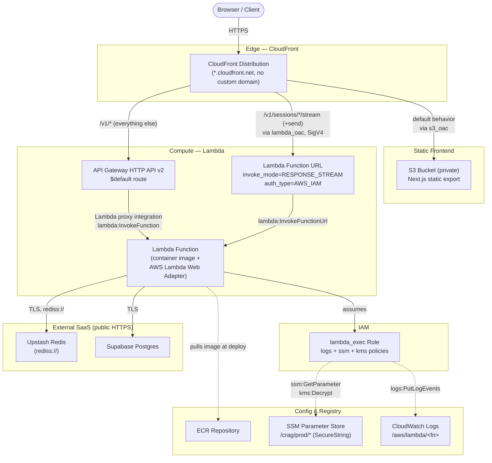

# Phase 15 — AWS Serverless Deployment: Step-by-Step

Scope: Lambda (container image) + API Gateway HTTP API + Lambda Function URL (streaming) + S3/CloudFront (frontend) + SSM Parameter Store + Upstash Redis, provisioned with Terraform, validated on LocalStack before real AWS. Full design/rationale lives in `plan.md`'s Phase 15 section and its Key Design Decisions table — this doc is the execution checklist only.

Status: planning only, nothing built yet. Renumbered 2026-07-07 (was Phase 16) so this deploy target sits before CI (now Phase 17) and CD (Phases 18–19), not after — see `plan.md`'s Decision note.

---

## Architecture Overview

---

## Prerequisites

**Tooling**
- Terraform CLI
- AWS CLI
- Docker (already in use since Phase 10)
- LocalStack CLI + `tflocal` (or manual `endpoints {}` overrides in the Terraform AWS provider)

**Accounts**
- Real AWS account
- LocalStack account — activate the **45-day Ultimate trial** only once ready to start building. The free Hobby tier covers Lambda/S3/IAM/SSM/DynamoDB/REST API Gateway but **not** HTTP API Gateway or CloudFront, both used here. Don't start the clock early — this same window also needs to cover Phase 16's ECS/ALB later.
- Upstash Redis account (free tier), replacing ElastiCache

**Locked decisions (not open for re-litigation, see `plan.md` for why)**
- Lambda Web Adapter, not Mangum
- Function URL (`RESPONSE_STREAM`) for chat/stream routes; HTTP API (v2) for everything else
- Next.js static export to S3 (not SSR/OpenNext)
- SSM Parameter Store (`SecureString`), not Secrets Manager
- Terraform remote state: S3 backend + DynamoDB lock table

---

## Stage A — Terraform scaffolding & app changes

1. Create `infra/` Terraform root: `aws` provider pinned to a region, S3+DynamoDB backend for remote state, variables for account/region/secret names.
2. Add the AWS Lambda Web Adapter layer to the backend `Dockerfile` (`AWS_LWA_INVOKE_MODE=RESPONSE_STREAM`, `PORT=8000`). Verify the image still runs unchanged via plain `docker run` before touching Terraform at all.
3. Add `boto3` to `backend/pyproject.toml`.
4. Update `config.py`'s `Settings` to read secrets via `boto3` SSM `get_parameter` calls at cold start when `APP_ENV=production`, falling back to `.env` locally — one class, two sources. This is real code, not infra.
5. Frontend: switch to `output: "export"`, audit for any server-only Next.js features that would break under static export (check `AuthProvider`'s route guard is fully client-side — it should be already), build.

## Stage B — Validate on LocalStack

6. Activate the LocalStack Ultimate trial.
7. Point Terraform at the LocalStack endpoint (`tflocal` or explicit provider `endpoints {}` overrides).
8. Build the adapter-enabled Docker image and push it to the LocalStack ECR-equivalent (this push is a manual/script step — Terraform provisions the ECR repo but doesn't build or push images itself).
9. Terraform apply against LocalStack:
   - `aws_lambda_function` (image-based)
   - `aws_lambda_function_url` (`RESPONSE_STREAM`) — **decide the auth type here** (`NONE` vs `AWS_IAM`) and confirm whether CloudFront's Origin Access Control actually supports a Lambda Function URL origin the way it does S3. `plan.md` doesn't resolve this — treat it as an open decision, not an assumption.
   - `aws_apigatewayv2_api` + Lambda proxy integration + routes for non-streaming paths
   - IAM execution role scoped to `ssm:GetParameter` + CloudWatch Logs
   - SSM `SecureString` parameters for every secret currently in `.env`
   - S3 bucket (private, OAC) + CloudFront distribution with three path-based behaviors: default → S3, `/v1/sessions/*/stream` (+ sync message-send route) → Function URL (caching disabled), everything else under `/v1/*` → HTTP API. Use CloudFront's default domain — skip custom domain/ACM for now.
10. Set the Upstash Redis URL as the local `REDIS_URL`/equivalent config value and confirm the existing `redis-py` client in `cache/` connects over `rediss://` (TLS) without code changes.
11. Smoke test against LocalStack: register → login → create session → chat → SSE stream.

## Stage C — Real AWS

12. Re-point the same Terraform config at real AWS (swap provider/backend config; resource definitions unchanged).
13. Build and push the real image to the real ECR repo.
14. `terraform apply` against real AWS.
15. Run the same manual smoke test against the live CloudFront URL.
16. `curl -N` (or equivalent) directly against the Function URL — confirm chunks arrive incrementally, not buffered.
17. Cold-start latency spot check.
18. Confirm the auth rate limiter (Phase 12) and the Redis-down fail-open behavior (Phase 3/4) still hold, now against real Upstash instead of `fakeredis`/local Redis.
19. Failure-path test: temporarily break the Upstash URL, confirm the same graceful-degrade behavior from Phase 4/6 holds against a real HTTP-based client.

## Stage D — Wrap-up

20. Document `terraform destroy` as the default between demos — nothing here should be left running 24/7 by accident.
21. Update `completed.md` / `plan.md` phase status once verified end-to-end.

---

## Open questions surfaced during this pass

- Lambda Function URL auth type + whether CloudFront OAC works with a Function URL origin (see Stage B, step 9) — needs a decision before that step, not during. **Resolved below.**
- Whether CI should be built first, deferred, or skipped for this deployment pass — **resolved 2026-07-07**: CI is now Phase 17, sequenced after both deploy phases (15/16) rather than before, so it's not a blocker for starting here — see `plan.md`.

---

## Resource Wiring Detail: IAM roles, security boundaries, inputs/outputs (added 2026-07-07, design only)

Fills in the permissions/roles/wiring left implicit in Stage A/B above. Nothing here is built yet — this is what to implement against, resource by resource, tomorrow.

**No VPC, therefore no security groups.** Lambda deliberately stays outside a VPC in this phase (Phase 16's Fargate reuses a VPC "unlike the Lambda in Phase 15, which deliberately avoided one" — `plan.md`), and API Gateway HTTP API, CloudFront, and S3 are never VPC-attached either. Nothing in this phase has a security group. The perimeter is instead three things: **identity-based IAM policies** (attached to the Lambda execution role — what the function may call outward), **resource-based policies** (attached to the Lambda function, the Function URL, and the S3 bucket — who may call in), and **auth-type flags** (the Function URL's `NONE` vs `AWS_IAM`). Phase 16's ALB + ECS task security groups are the first place in this project's AWS work where a security group actually applies.

**Per-resource IAM / resource policy / wiring table:**

| Resource (Terraform type) | IAM or resource policy attached | Inputs (← from) | Outputs (→ consumed by) |
|---|---|---|---|
| tfstate bucket + versioning (`aws_s3_bucket`) | Bucket policy restricting access to the operator/CI IAM principal only | — (bootstrapped first, by hand or a throwaway local-backend apply) | referenced in every other resource's `backend "s3" {}` block |
| lock table (`aws_dynamodb_table`, `hash_key = "LockID"`, pay-per-request) | none of its own; operator/CI role needs `dynamodb:GetItem/PutItem/DeleteItem` scoped to its ARN | — | used implicitly by Terraform during every `apply`/`plan` |
| backend image repo (`aws_ecr_repository`) | none needed for same-account pulls — Lambda can pull from an ECR repo in the same account/region automatically; a repository policy is only needed cross-account | — | `repository_url` → image push target (script step) and → Lambda function's `image_uri` |
| `lambda_exec` role (`aws_iam_role`) | trust policy: only `lambda.amazonaws.com` may `sts:AssumeRole`. Three scoped inline policies attached — see below | — | `arn` → Lambda function's `role` |
| function log group (`aws_cloudwatch_log_group`, explicit `retention_in_days`) | — | name must match `/aws/lambda/<function_name>`, which the logs policy below scopes to | avoids Lambda's default auto-created group (infinite retention) |
| backend function (`aws_lambda_function`, `package_type = "Image"`) | runs as `lambda_exec` role | `role` ← lambda_exec.arn; `image_uri` ← ECR repo `repository_url` + pushed tag | `function_name`/`arn` → its own `aws_lambda_permission` resources and the Function URL; `invoke_arn` → API Gateway integration |
| API Gateway → Lambda permission (`aws_lambda_permission`, resource-based, not a role) | principal `apigateway.amazonaws.com`, `source_arn = "${api.execution_arn}/*/*"` | `function_name` ← Lambda; `source_arn` ← API Gateway `execution_arn` | this, not an IAM role, is what actually lets API Gateway invoke the function |
| streaming Function URL (`aws_lambda_function_url`, `invoke_mode = RESPONSE_STREAM`) | `auth_type = "AWS_IAM"` — resolves the open question above | `function_name` ← Lambda | `function_url` (host) → CloudFront's streaming-behavior origin |
| CloudFront → Function URL permission (`aws_lambda_permission`, resource-based) | `action = "lambda:InvokeFunctionUrl"`, principal `cloudfront.amazonaws.com`, `source_arn` = CloudFront distribution ARN, `function_url_auth_type = "AWS_IAM"` | `source_arn` ← CloudFront distribution `arn` | together with the Function URL's `AWS_IAM` auth type, this is the entire perimeter around the streaming path |
| HTTP API + integration + `$default` route + stage (`aws_apigatewayv2_*`) | no IAM role on the API itself — the Lambda-side resource policy above is the only gate; HTTP API v2 has no resource-policy equivalent to REST API's | `integration_uri` ← Lambda `invoke_arn`; `payload_format_version = "2.0"` | `api_endpoint` → CloudFront's `/v1/*` origin; `execution_arn` → the API-Gateway-to-Lambda permission above |
| SSM parameters, one per `.env` secret (`aws_ssm_parameter`, `for_each`, `type = SecureString`) | governed entirely by `lambda_exec`'s ssm + kms policies below — nothing else reaches these | path prefix `/crag/prod/<KEY>` | read at cold start by `config.py`'s `Settings` via `boto3 get_parameter(WithDecryption=True)` — a runtime edge, not a Terraform-graph one |
| frontend bucket (`aws_s3_bucket` + `aws_s3_bucket_policy`) | bucket policy: principal `cloudfront.amazonaws.com`, `Condition.StringEquals["AWS:SourceArn"]` = CloudFront distribution ARN. All four block-public-access settings on | `bucket_regional_domain_name` used by CloudFront's default origin | policy's `AWS:SourceArn` ← CloudFront distribution `arn` |
| two Origin Access Controls (`aws_cloudfront_origin_access_control`) — `s3_oac` and `lambda_oac` | — | `s3_oac`: `origin_type = "s3"`; `lambda_oac`: `origin_type = "lambda"`, `signing_protocol = "sigv4"` | used by the distribution's S3 and Function URL origins respectively |
| CloudFront distribution (`aws_cloudfront_distribution`, default `*.cloudfront.net` domain, no ACM/custom domain this phase) | no IAM role; access to each origin is governed by that origin's own resource policy (above) | three origins: default → S3 (via `s3_oac`); `/v1/sessions/*/stream` (+ sync send route) → Function URL host (via `lambda_oac`, caching disabled, all headers/query strings/cookies forwarded); everything else under `/v1/*` → API Gateway `api_endpoint` | `domain_name` is the terminal output (the app's public URL); `arn` feeds back into the Lambda-permission and S3-bucket-policy `source_arn` conditions above |
| Upstash Redis, Supabase Postgres (not Terraform-managed, not AWS) | none — access control is a token/password embedded in the connection URL (`rediss://` for Upstash); no VPC peering or PrivateLink since Lambda isn't in a VPC to peer from | — | connection URLs are stored as the *values* of two SSM parameters above — that's their only touchpoint with this infrastructure |

**Lambda execution role — the three scoped policies** (deliberately not the AWS-managed `AWSLambdaBasicExecutionRole`, so the role stays self-documenting):

1. **Logs** — `logs:CreateLogGroup`, `CreateLogStream`, `PutLogEvents`, scoped to `arn:aws:logs:*:*:log-group:/aws/lambda/<function-name>:*`.
2. **SSM** — `ssm:GetParameter`, `GetParametersByPath`, scoped to `arn:aws:ssm:*:*:parameter/crag/prod/*`. Read-only — the function never writes secrets.
3. **KMS** — `kms:Decrypt` on the key behind `alias/aws/ssm` (the default AWS-managed key; no customer-managed key needed at this scale). **Easy to miss:** `ssm:GetParameter` alone is not sufficient for `SecureString` parameters — SSM makes a KMS `Decrypt` call under the caller's identity, so without this the function 403s on every secret read at runtime, not at `terraform apply` time.

**Open question resolved:** use `AWS_IAM`, not `NONE`, for the Function URL's `auth_type`. CloudFront added Origin Access Control support for Lambda Function URL origins in 2023, so OAC can sign requests to a Function URL the same way it already does for S3. `NONE` would leave the URL invokable by anyone on the internet who finds it, with no reason to accept that once OAC is available. Flag for the LocalStack pass (Stage B): verify LocalStack Ultimate actually emulates OAC-signed Function URL calls before relying on it there — this is a newer AWS feature and its LocalStack fidelity is unverified; real AWS supports it regardless.

**Operator/CI permissions** (separate from any resource's own role — this is what your own IAM user/CLI profile needs to run `terraform apply` at all): S3 + DynamoDB CRUD on the state bucket/lock table; ECR `GetAuthorizationToken` + push actions; IAM `CreateRole`/`PutRolePolicy`/**`PassRole`** (the last one specifically — Terraform needs permission to hand the `lambda_exec` role to the Lambda function at creation time, a common source of an unexplained `apply`-time 403 if scoped too tight); standard Create/Update/Delete actions on lambda, apigateway, cloudfront, ssm, s3, and logs, since Terraform is what's provisioning all of them.

**Full wiring order** (the sequence Terraform actually needs things to exist in, tracing every output→input edge above): state bucket/lock table exist → ECR repo created, image built and pushed (script, not Terraform) → `lambda_exec` role + its three policies → SSM parameters (no dependency on the role, only the role's policy path prefix depends on their naming convention) → Lambda function (needs role + image) → HTTP API + integration (needs `invoke_arn`) → the API-Gateway-to-Lambda permission closes that loop (needs `execution_arn`) → Function URL created with `AWS_IAM` auth → frontend bucket created (policy attached later) → both OACs created → CloudFront distribution (needs the S3 domain, Function URL host, and `api_endpoint`) → the CloudFront-to-Function-URL permission and the S3 bucket policy both close their loops back to the now-existing distribution ARN → `domain_name` is the finish line used for the Stage B/C smoke test.
